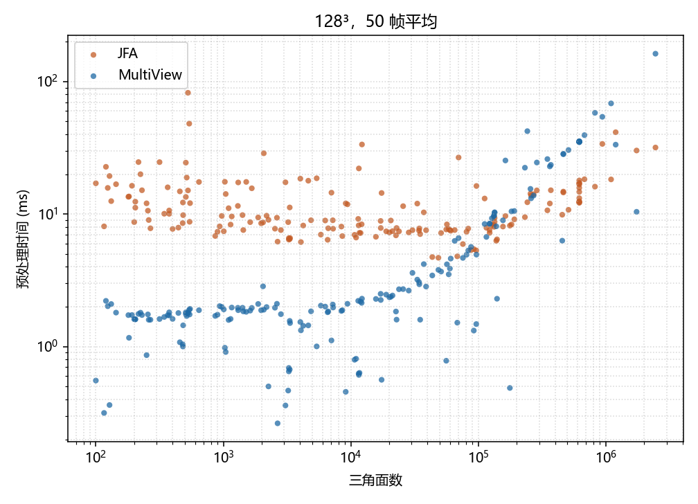

# 复杂度说明：实测与论文表述

2026-09-24。机器是 i5-10600KF、RTX 2060 SUPER、16 GB、Windows 11。计时是现有 `CollectFrameTimestamps` 的 GPU 时间，不含加载、窗口和交换链。图上只有 JFA 和本方法，没有 TCKB22 和 Barill，也没有求值时间和误差。

下面两套图回答不同的轴。Thingi10K 散点固定分辨率看面数。checked 折线固定面数看分辨率和相机数，并拆开深度与融合。

## Thingi10K：固定 \(128^3\)，预处理时间随三角面数

协议是预热 50 帧、测量 50 帧取平均，分辨率 \(128^3\)。图题写的是「50 帧平均」。这张图比后面的 checked 折线更接近论文默认协议。

数据来自 Thingi10K。官方标记筛出 `solid`、单连通、`closed`、`manifold`，在 9995 个模型里留下 4075 个。按面数对数分成 10 桶，每桶目标 20 个，最高桶只有 5 个可用，共 185 个。清单和筛选摘要：

- [thingi10k_models.txt](../Renderer/Asset/Sdf/DatasetBench/thingi10k_models.txt)
- [thingi10k_manifest.csv](../Renderer/Asset/Sdf/DatasetBench/thingi10k_manifest.csv)
- [thingi10k_summary.json](../Renderer/Asset/Sdf/DatasetBench/thingi10k_summary.json)
- 原始计时：[bench_thingi10k.csv](../Build/bench_thingi10k.csv)（本机 `Build/`，已被 git 忽略）

这次跑在实体网格和 SDF 分辨率拆开之前。`--resolution 128` 同时定了体素网格和 SDF。相机预算跟当时的 `Config.json5`，没有用 `--cameras` 扫 K。

橙色是 JFA，蓝色是本方法。JFA 几乎不随面数变：185 个模型的中位数 9.5 ms，第 10 到第 90 百分位大约 6.8–18.5 ms。低面数有少数离群点到几十毫秒，主体仍是一条水平带。固定分辨率时，JFA 的墙钟时间由网格决定，不由 \(M\) 决定。

本方法在大约 \(10^4\) 面以下多数落在 1–3 ms，明显快于 JFA。过了大约 \(10^5\) 面开始抬升；\(10^5\)–\(3\cdot10^5\) 中位数约 10 ms，\(3\cdot10^5\)–\(10^6\) 约 35 ms。对 \(M\ge10^5\) 的点做对数斜率，大约 0.85，接近随面数线性。185 对里本方法更快 146 次，JFA 更快 39 次。第一次本方法慢于 JFA 出现在约 \(8.8\cdot10^4\) 面；之后高面数段多数被深度项盖过。

这张图只支持 \(O(K(M+N^3))\) 里的 \(KM\)。分辨率固定，融合项对所有点几乎一样，所以看不到 \(KN^3\)，也比不了 JFA 的 \(\log N\)。论文里「高面数时光栅化成为新瓶颈」用这张图说。低面数优势、以及随 \(N\) 怎么变，要看下一节。

## checked 折线：固定模型，随 \(N\) 和 \(K\)

这组数用来拆深度和融合。它不是论文表：预热 3 帧、测量 5 帧取平均，不是 50+50。

当时的配置：八叉树最细 \(64^3\)，挑选 \(16^3\) 到 \(4^3\)，深度图 \(64^2\)，`MeshToSdfQuality` 为 Ultra。`--resolution` 只改 SDF 分辨率，不改八叉树。N 扫描固定 K=16，分辨率 16、32、64、128、256、512。K 扫描固定 \(128^3\)，相机数 8、12、16、24、32、48、64。14 个模型都在 `Models/checked/`。

三张图和总表在 `Build/checked_lines/`。这个目录被 git 忽略，链接只在本机有效。

固定 K=16，预处理总时间随分辨率。左本方法，右 JFA。纵轴对数。

固定 \(128^3\)，预处理总时间随相机数。

固定 K=16，本方法的深度和融合分开。

总表：[checked_lines.csv](../Build/checked_lines/checked_lines.csv)。每次运行的原始 CSV 也在同一目录，文件名是 `n<分辨率>_k<相机数>.csv`。

### 图在说什么

随分辨率的那张图里，JFA 的 14 条线叠在一起往上走，接近体积。本方法在 \(256^3\) 之前按面数分成几条几乎水平的带子，过了 \(256^3\) 才一起抬起来。

随相机数的那张图里，本方法随 K 上升，面数越高越陡；JFA 是水平的。

阶段图把这个拆开了。深度是按面数分开的水平带，不随分辨率变。融合是 14 个模型挤成的一条线，过了 \(64^3\) 按体积涨。所以总时间就是这两项相加：面数高时看深度，分辨率高、面数低时看融合。这和 Thingi10K 散点一致：散点是固定 \(N\) 看 \(M\)，折线是固定 \(M\) 看 \(N\) 和 \(K\)。

## checked 关键数字

K=16。时间单位是毫秒。深度在整个 N 扫描里几乎不变，融合从 \(128^3\) 起每次翻倍接近 8 倍。

| 模型 | 三角面 | 项 | 16³ | 64³ | 128³ | 256³ | 512³ |
|---|---:|---|---:|---:|---:|---:|---:|
| model3 | 128 | 深度 | 0.06 | 0.06 | 0.06 | 0.06 | 0.06 |
| model3 | 128 | 融合 | 0.01 | 0.06 | 0.39 | 3.26 | 25.75 |
| model3 | 128 | JFA | 0.09 | 1.14 | 7.72 | 56.63 | 476.57 |
| happy_15k | 14765 | 深度 | 0.49 | 0.50 | 0.51 | 0.50 | 0.51 |
| happy_15k | 14765 | 融合 | 0.02 | 0.07 | 0.40 | 3.51 | 28.15 |
| happy_15k | 14765 | JFA | 0.16 | 0.71 | 5.71 | 52.18 | 170.23 |
| dragon871k | 871414 | 深度 | 40.44 | 40.79 | 40.41 | 40.36 | 40.47 |
| dragon871k | 871414 | 融合 | 0.02 | 0.07 | 0.40 | 2.91 | 28.31 |
| dragon871k | 871414 | JFA | 3.32 | 4.68 | 9.15 | 53.06 | 174.38 |

14 个模型在 K=16 时融合时间的中位数：16³ 为 0.013，32³ 为 0.014，64³ 为 0.060，128³ 为 0.386，256³ 为 3.06，512³ 为 27.2。相邻档的倍数是 1.06、4.2、6.4、7.9、8.9。前两档盖着大约 0.013 ms 的固定开销，后面才露出 \(N^3\)。同一档上 14 个模型的融合极差很小，512³ 时是 25.2–28.3 ms，和面数无关。

同一条龙在 \(128^3\) 上随 K：深度从 K=8 的 20.4 ms 到 K=64 的 161 ms，大约按 K 的倍数。`model3` 的融合从 0.21 ms 到 1.73 ms，也大约 8 倍；它的深度一直在 0.05–0.09 ms。

## 龙从 256³ 到 512³

早先 14 模型扫描里，`dragon871k` 在 512³ 出现过 3607 ms。单独重跑没有复现。单独重跑的原始行：

- [bench_dragon_n256.csv](../Build/bench_dragon_n256.csv)：本方法 44.45 ms，其中深度 41.06、融合 2.90；JFA 55.26。
- [bench_dragon_n512.csv](../Build/bench_dragon_n512.csv)：本方法 68.69 ms，其中深度 42.31、融合 25.88；JFA 459.27。

今天这张全模型图里的同一条龙是 43.77 ms 到 69.28 ms，深度 40.36 到 40.47，融合 2.91 到 28.31，和单独重跑一致。80 倍那一笔不再使用。分辨率翻倍加上去的大约 24 ms 是融合，约 9 倍，落在 \(KN^3\) 里。深度不动，因为面数和 K 都没变。

## JFA 是不是 \(N^3 \log N\)

操作数是。`MeshToSdf.cpp` 里 Ultra 路径的步数是 \(\lfloor \log_2 N \rfloor\)，每步对整张 \(N^3\) 网格派发一次。16³ 到 512³ 的步数是 4、5、6、7、8、9，另有一次初始化和一次收尾。论文可以继续引用 Rong and Tan 的 \(O(N^3 \log N)\)，但要写成 pass 数。

墙钟时间不是。\(N^3\) 每次翻倍约 8 倍，\(N^3 \log_2 N\) 在 256³ 到 512³ 约 9 倍。14 个模型在 64³ 到 512³ 的对数斜率中位数是 2.7，低于 3。256³ 到 512³ 的倍率从 `happy_291k` 的 1.25 倍到 `bunnyfixed3k` 的 9.45 倍，中位数约 5 倍。这段分辨率上对数只从 6 步变成 9 步，多出来的比例被模型之间的散布盖住了。

## 论文句子怎么改

保留第 140–141 行的 \(O(K(M+N^3))\)，并按阶段写死：

- 深度是 \(KM\)，不随 SDF 分辨率变。
- 融合是 \(KN^3\)，不随面数变。
- 实体体素化和相机挑选在单独配置的八叉树上，不随输出分辨率涨。沿一条轴的前缀和是 \(O(R^3)\)，\(R\) 是八叉树分辨率，没有 \(K\)。第 202 行不要再写成 \(O(KN^3)\)。

删掉“瓶颈从输出分辨率移到模型复杂度”“和分辨率脱钩”“去掉 \(\log N\) 所以斜率更好”“高分辨率优势变得压倒性”这几类句子。摘要、第 73、81、142、558、595、790 行都在这几类里。

改成的意思：瓶颈在 \(KM\) 和 \(KN^3\) 之间切换。JFA 的对数在 pass 数里；两种方法的墙钟时间在 16³ 到 512³ 上都由 \(N^3\) 的访存决定。本方法的融合只扫一遍，体积项的常数更小。面数高时深度盖过这个优势，直到融合追上。`happy_15k` 在 512³、K=16 是融合约 28 ms 对 JFA 约 170 ms；`model3` 是 26 ms 对 477 ms。这是少扫很多遍，不是指数更低。

表里 0.667 ms 到 5.568 ms、0.47 ms 到 0.73 ms 只到 \(128^3\)，而且是旧协议。不能再当作“去掉对数所以斜率更平”的证据。正文的分辨率曲线改用按阶段拆开的测量，并写明预热、重复、八叉树和挑选范围。正式进论文之前按 50+50 重跑。
